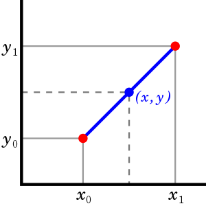
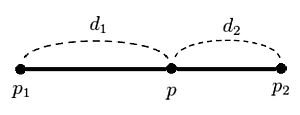

# 선형보간
#### 선형 보간이 무엇인가?
시작점 (x0,y0)과 끝 점(x1,y1)이 주어졌을 때 그 사이에 위치한 값(x,y)을 추정하기 위해, 직선 거리를 따라 선형적으로 계산하는 것

즉, 두 점의 사이에 위치한 값을 구할 수 있는 수단이다.

 
 * * *
#### 어디에 쓰일까?
여태 내 경험상으로는 물체의 자연스러운 회전, 자연스러운 이동(초당 이동)에 쓰였다. 유니티 엔진에서는 Slerp, Lerp 함수로 구현되어 있었다.
* * *
#### 게임에서의 보간법
게임 안의 한 오브젝트를 한 장소에서 다른 장소로 이동할 때 점진적으로 이동시켜야 할 때가 있다. 보간법이란 즉, 한 값에서 다른 값으로 점진적으로 이동시킬 때 (즉, 변화가 눈에 보이도록 매끄럽게) 사용하는 방법이다.

벡터의 각 성분들을 보간한다.
* * *
#### 수학적 정의
예를 들어, 위 그림의 두 점 (x0,y0), (x1,y1)이 주어졌을 때 그 사이에 위치한 (x,y)의 값을 알아내기 위해 두 점 사이에 직선을 긋고 이와 같은 비례식을 도출해낼 수 있다.

<<<<<<< HEAD


이 식을 풀면 어떤 주어진 x값에 대한 y의 값을 구할 수 있다.


* * *
#### 사용을 위한 일반화


두 지점 p1,p2의 데이터 값 f(p1),f(p2)가 주어졌을 때 이 두 지점 사이의 지점 p의 데이터값 f(p)는 다음과 같이 계산 가능하다.


만약 거리 d2, d1의 합이 1이 되도록 정규화한다면 (즉, d1+d2=1) 위 식은 단순화된다.


=======


이 식을 풀면 어떤 주어진 x값에 대한 y의 값을 구할 수 있다.


* * *
#### 사용을 위한 일반화


두 지점 p1,p2의 데이터 값 f(p1),f(p2)가 주어졌을 때 이 두 지점 사이의 지점 p의 데이터값 f(p)는 다음과 같이 계산 가능하다.


만약 거리 d2, d1의 합이 1이 되도록 정규화한다면 (즉, d1+d2=1) 위 식은 단순화된다.


>>>>>>> 032e341270b512d4b85751318af7fd1906ba0ad5

* * *
#### 게임 스크립팅 (의사 코드)
위의 단순화된 식에 적절한 상수를 곱해 유연한 값을 만들 수 있도록 거리의 합이 1이 되도록 해야 한다.

```
//p1, p2를 d1:d2로 분할하는 점 p를 리턴
float lerp(float p1, float p2, float d1)
{
  return (1-d1) * p1 + d1 * p2;
  //d1+d2 = 1이므로 d2 = 1 - d1
}
```
